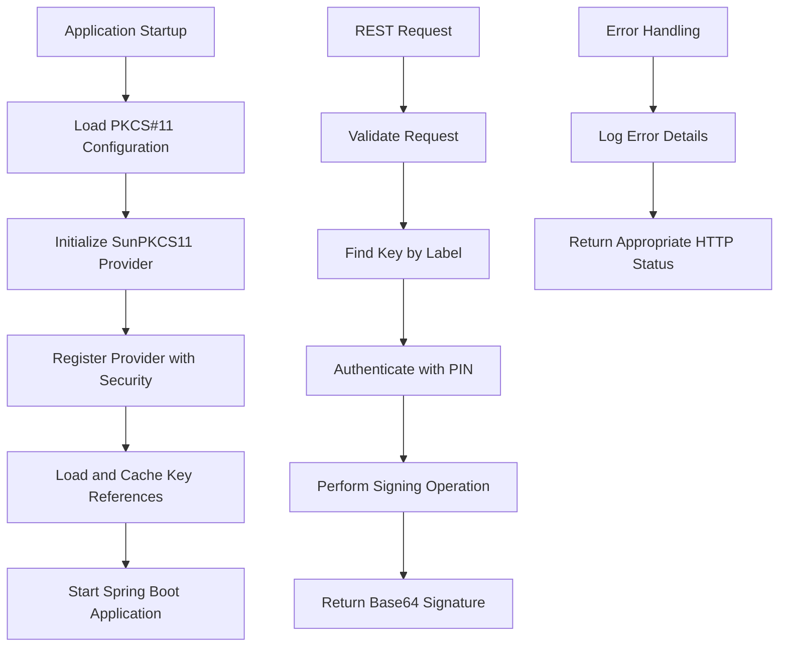
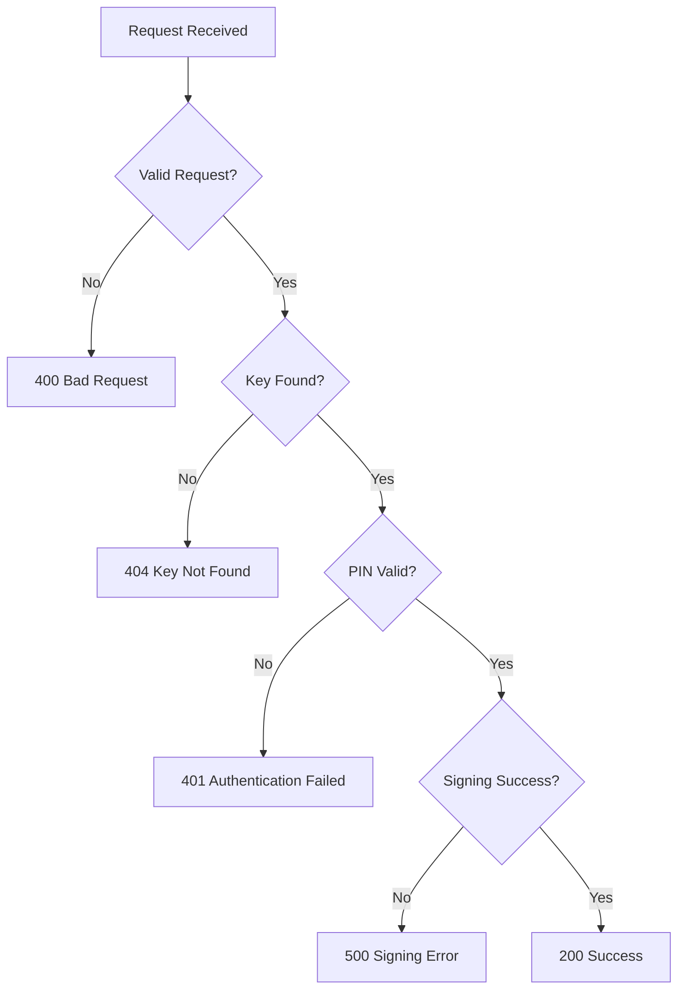

# 📋 Implementation Plan: PKCS#11 Signing Service

## Overview
This document outlines the detailed implementation plan for the Spring Boot + SunPKCS11 signing service based on the Product Requirements Document (PRD).

## 1. Project Structure

```
spring-boot-sunpkcs11/
├── pom.xml
├── src/
│   ├── main/
│   │   ├── java/
│   │   │   └── com/example/pkcs11/
│   │   │       ├── Pkcs11SigningApplication.java
│   │   │       ├── config/
│   │   │       │   ├── Pkcs11Config.java
│   │   │       │   └── Pkcs11Properties.java
│   │   │       ├── service/
│   │   │       │   ├── Pkcs11ProviderService.java
│   │   │       │   └── SigningService.java
│   │   │       ├── controller/
│   │   │       │   └── CryptoController.java
│   │   │       ├── dto/
│   │   │       │   ├── SignRequest.java
│   │   │       │   └── SignResponse.java
│   │   │       └── exception/
│   │   │           ├── GlobalExceptionHandler.java
│   │   │           ├── KeyNotFoundException.java
│   │   │           └── SigningException.java
│   │   └── resources/
│   │       ├── application.yml
│   │       └── application-dev.yml
│   └── test/
│       └── java/
│           └── com/example/pkcs11/
│               ├── integration/
│               │   └── CryptoControllerIntegrationTest.java
│               └── service/
│                   └── SigningServiceTest.java
├── k6/
│   └── sign-loadtest.js
└── README.md
```

## 2. Implementation Flow



## 3. Core Components

### 3.1 Configuration Management
- **Pkcs11Properties**: Configuration binding for YAML properties
- **Pkcs11Config**: Spring configuration bean for provider setup
- Support for multiple key configurations with different PINs

### 3.2 PKCS#11 Provider Service
- Dynamic SunPKCS11 provider registration
- Runtime configuration file generation
- Provider lifecycle management
- Key caching for performance

### 3.3 Signing Service
- Core signing logic for RSA and ECC algorithms
- Key lookup by label
- PIN-based authentication
- Thread-safe operations

### 3.4 REST API Layer
- Single endpoint: `POST /v1/crypto/sign`
- Request/response DTOs with validation
- Comprehensive error handling
- JSON-based communication

## 4. Key Features Implementation

### 4.1 Dynamic Provider Configuration
```java
// Runtime PKCS#11 config generation
String configContent = String.format(
    "name = %s\nlibrary = %s\nslot = %d\n",
    providerName, libraryPath, slotIndex
);
```

### 4.2 Multi-Key Support
```yaml
pkcs11:
  library: /path/to/pkcs11/library.so
  slot: 0
  keys:
    - label: my-rsa-key
      pin: 1234
      type: RSA
    - label: my-ecc-key
      pin: 5678
      type: EC
```

### 4.3 Security Considerations
- PIN storage in configuration (externalized)
- No PIN logging or exposure
- Secure key handle management
- Input validation and sanitization

## 5. Testing Strategy

### 5.1 Unit Tests
- Provider registration logic
- Key loading mechanisms
- Signature generation (mocked)
- Configuration validation

### 5.2 Integration Tests
- Full REST endpoint testing
- Real PKCS#11 provider interaction
- Error scenario validation
- Multi-key configuration testing

### 5.3 Load Testing
- k6 script for concurrent signing requests
- Performance metrics collection
- Throughput and latency measurement

## 6. Configuration Examples

### 6.1 Generic HSM Configuration
```yaml
pkcs11:
  library: ${PKCS11_LIBRARY:/opt/hsm/lib/libpkcs11.so}
  slot: ${PKCS11_SLOT:0}
  provider-name: ${PKCS11_PROVIDER_NAME:HSM-Provider}
  keys:
    - label: ${RSA_KEY_LABEL:rsa-signing-key}
      pin: ${RSA_KEY_PIN:1234}
      type: RSA
    - label: ${ECC_KEY_LABEL:ecc-signing-key}
      pin: ${ECC_KEY_PIN:5678}
      type: EC
```

### 6.2 Development Configuration (SoftHSM2)
```yaml
pkcs11:
  library: /usr/local/lib/softhsm/libsofthsm2.so
  slot: 0
  provider-name: SoftHSM-Provider
  keys:
    - label: test-rsa-key
      pin: 1234
      type: RSA
```

## 7. Error Handling Strategy



## 8. Performance Optimizations
- Provider singleton pattern
- Key handle caching
- Connection pooling for HSM
- Async logging for performance monitoring

## 9. Deployment Considerations
- JAR packaging with embedded Tomcat
- External configuration via environment variables
- Health check endpoints
- Graceful shutdown handling

## 10. Implementation Steps

### Phase 1: Project Setup
1. Create Maven project structure
2. Configure `pom.xml` with dependencies
3. Set up basic Spring Boot application
4. Create configuration classes

### Phase 2: Core Services
1. Implement PKCS#11 provider service
2. Create signing service with RSA/ECC support
3. Add key management and caching
4. Implement security measures

### Phase 3: REST API
1. Create DTOs for request/response
2. Implement REST controller
3. Add validation and error handling
4. Configure JSON serialization

### Phase 4: Testing
1. Write unit tests for core components
2. Create integration tests
3. Set up k6 load testing
4. Performance validation

### Phase 5: Documentation
1. Create comprehensive README
2. Add API documentation
3. Configuration examples
4. Deployment guides

## 11. Dependencies (Maven)

```xml
<properties>
    <java.version>11</java.version>
    <spring-boot.version>2.7.14</spring-boot.version>
</properties>

<dependencies>
    <!-- Spring Boot Starters -->
    <dependency>
        <groupId>org.springframework.boot</groupId>
        <artifactId>spring-boot-starter-web</artifactId>
    </dependency>
    <dependency>
        <groupId>org.springframework.boot</groupId>
        <artifactId>spring-boot-starter-validation</artifactId>
    </dependency>
    <dependency>
        <groupId>org.springframework.boot</groupId>
        <artifactId>spring-boot-configuration-processor</artifactId>
        <optional>true</optional>
    </dependency>
    
    <!-- Testing -->
    <dependency>
        <groupId>org.springframework.boot</groupId>
        <artifactId>spring-boot-starter-test</artifactId>
        <scope>test</scope>
    </dependency>
</dependencies>
```

## 12. Success Criteria
- ✅ REST API responds to signing requests
- ✅ Multiple key configurations supported
- ✅ Generic HSM compatibility
- ✅ Comprehensive error handling
- ✅ Load testing with k6
- ✅ Unit and integration tests
- ✅ Secure PIN handling
- ✅ Performance optimizations

This implementation plan provides a comprehensive roadmap for building a production-ready PKCS#11 signing service that meets all requirements specified in the PRD.